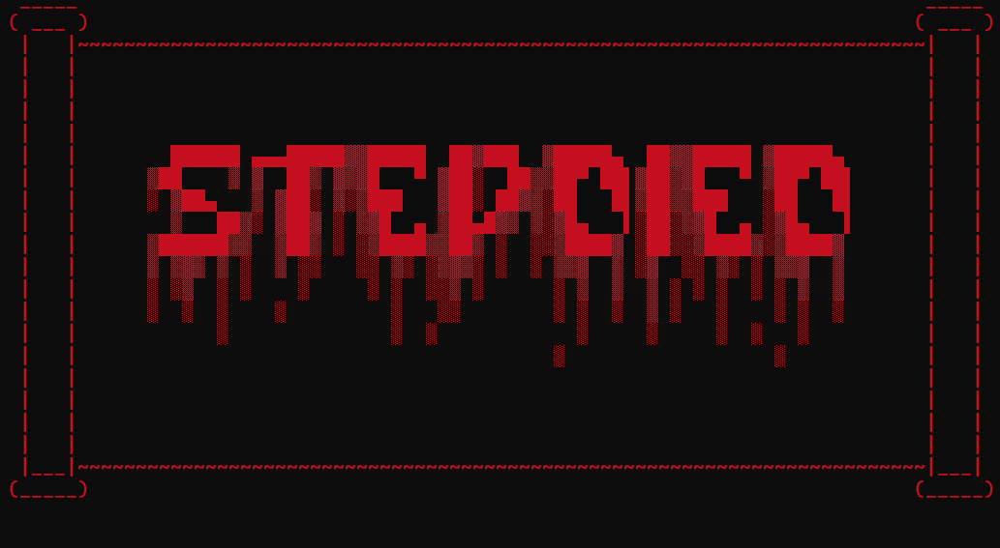
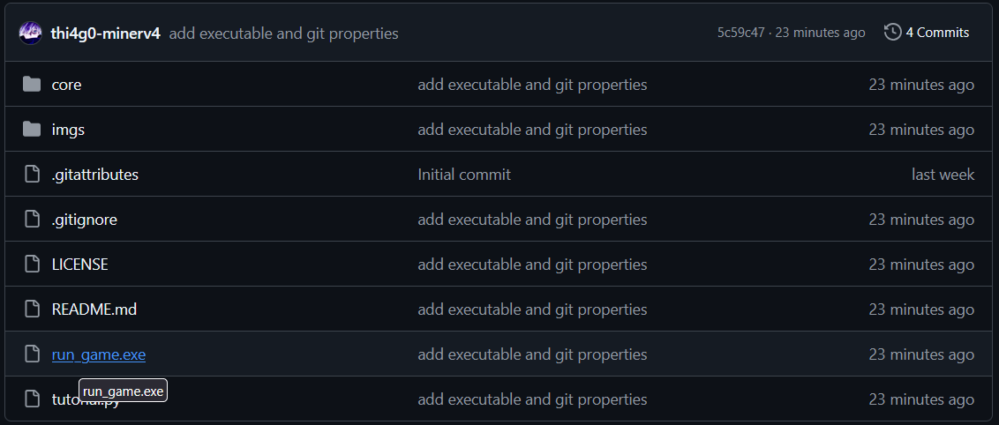
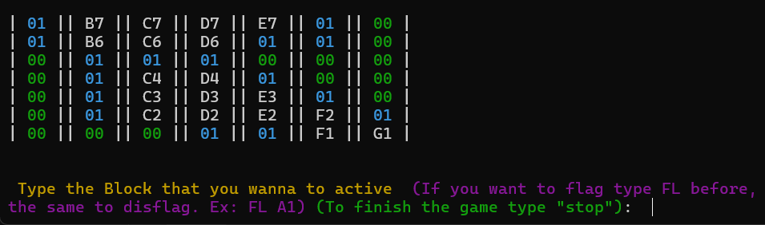
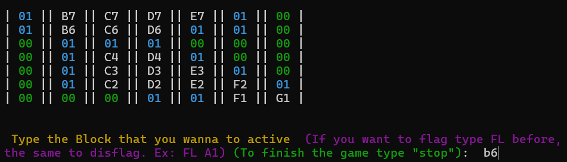
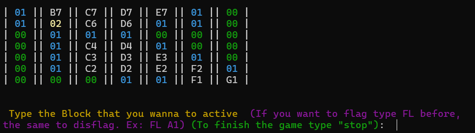
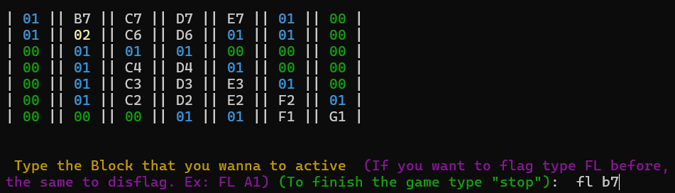
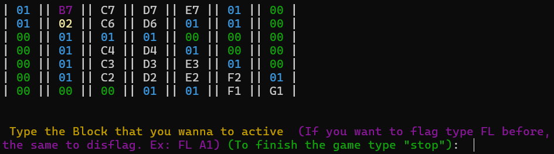
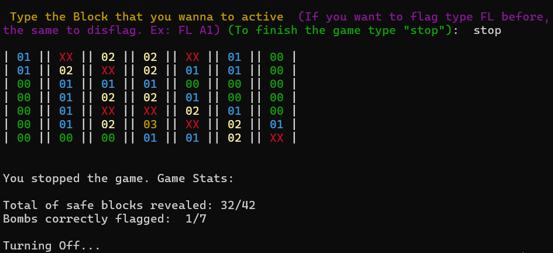
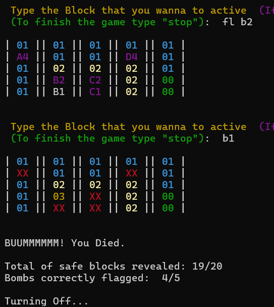
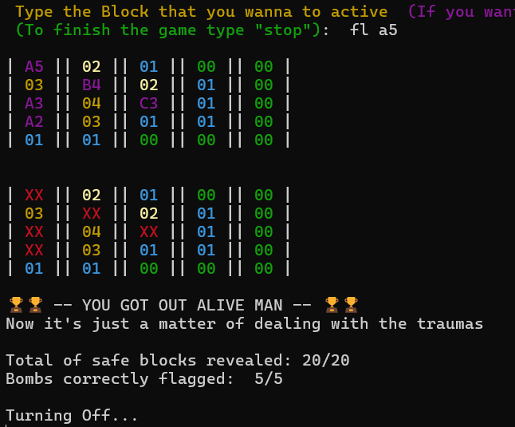

 

# StepDied (Minesweeper)

## 🎮-- O que é? E como rodar? --🕹️

### 💣 Proposta do jogo 
O StepDied é um jogo inteiramente feito em Python por mim (Thiago) com a intenção de testar minha lógica e conhecimentos de Python. O jogo é literalmente um Campo Minado (ou Minesweeper se preferir), mesmas regras e funções. Ele é jogado no  terminal atráves de um Grid visual e inputs, só!!! E como você pode jogar ele?
 

### 💾 Como rodar o jogo

- <strong> 1- Instale o arquivo .exe (run_game.exe) localizado no repo 👇 </strong>

- <strong> 2- Execute ele, iniciando um programa básico que montei com a lógica do jogo.  </strong>

- <strong> 3- Seja feliz testando sua lógica!  </strong>

 

## 📜 --Tutorial de StepDied-- 📜

### ✅ Funcionamento Básico
Campo minado pode parecer díficil se você nunca jogou antes (o que acho difícil), porém é bem simples de entender. Basicamente, o jogo é um tabuleiro, composto por blocos, como uma tabela. Nesse tabuleiro, possuem blocos seguros e blocos com bombas. Você não sabe o que tem em cada bloco, até você "ativar" ele. Ativando ele, se for uma bomba... Você morre, se for um bloco seguro, uma informação é revelada a você, a de quantas bombas tem em volta dele.

### 💣 Como Jogar
- <strong>1- Ao iniciar o jogo você verá um grid, que é o mapa do jogo (Por padrão os blocos com 0 e 1 bombas em voltas já vem ativados) 👇 </strong>

Como você pode ver, os blocos são nomeados de acordo com seus índices, C3, D3, E3 e etc... Você também pode perceber que tem blocos coloridos, eles já vem (por padrão) ativados, e estão indicando o número de bombas ao redor deles

##
 

- <strong>2- Para ativar um bloco basta digitar o nome dele (índice) e pressiona ENTER</strong>

☝️ Ao ativá-lo (caso não for uma bomba) ele revelará quantas bombas tem ao seu redor, nesse caso possui 2 bombas ao redor. Observando o mapa, podemos ter certeza que o bloco B7 é uma bomba, pois o bloco A6 (já ativado) só possui 1 bomba em volta e todos os blocos em volta dele estão revelados... com exceção do B7.

##
 

- <strong>3- Quando tiver certeza de que um bloco é uma bomba, coloque uma FLAG nele. Para isso digite "FL bloco" (Ex: FL B7)</strong>

Com isso você "marca" aquele bloco como se ele fosse uma bomba, assim o jogo te impede de ativar esse bloco digitando o índice dele acidentalmente (Já aconteceu comigo😔) e você pode ter uma visão mais clara do jogo. Caso coloque uma Flag em um bloco errado, é só usar "FL bloco" no bloco de novo.

##
 

- <strong>4- Se ativar uma bomba... Game Over na hora</strong>
 
Nesse jogo, cliquei no último bloco e era uma bomba, então o jogo se encerra automaticamente. Com isso ele mostra o mapa completo, com todos os blocos revelados e também a minha pontuação, no caso os blocos seguros que ativei e as bombas que dei Flag corretamente.

##
 

- <strong>5- Para encerrar o jogo, digite "stop". Isso também revelará o mapa e a sua pontuação</strong>

Em resumo, essas são todas as ações que você pode realizar até a versão atual do jogo.

##

### 🏆 Objetivo/Como Vencer

O objetivo do jogo em seu cerne é sobreviver, não pegar nenhuma bomba, porém como você na prática vence ele? O jogo se encerra automaticamente (te dando a vitória) quando você ativa todos os blocos seguros e coloca um Flag em todas as bombas corretamente. Quando isso acontecer, você verá a seguinte tela de vitória 👇
 
 

 
 
## ⚙️ -- Funcionamento -- ⚙️
### 📂 Estrutura do Projeto
O jogo em si está todo dentro da pasta `core`, lá se encontram 3 pastas: `assets`, `modules` e `objects`.

- <strong> Assets: </strong> Por mais que ainda não possua quase nada, meu objetivo é que essa pasta seja como um config.py, voltada a estilização do jogo. Por enquanto só possui a variável `title`, mas no futuro, pretendo que lá fique as constantes do jogo e toda parte do visual do jogo, tornando ele mais versátil e beirando o 100% personalizável.
- <strong> Modules: </strong> Todos os módulos independentes vão ficar aqui. Por enquanto também não tem muita coisa (somente a função block_appearence), e de fato não vejo a necessidade de ter muitas coisas por enquanto. A maioria das funções está presente na parte interna das classe, e é o que faz mais sentido para a forma que o programa funciona.
- <strong> Objects: </strong> Essa pasta é o core do `core`, ali contém toda lógica do jogo, embutida em classes, que possuem atributos e métodos essenciais para o jogo.

### 💻 Classes / POO
Todo o jogo é funciona com base em POO, possuindo as 3 classes principais: `Game`, `Map`, `Block`.

- <strong> Game: </strong>
- <strong> Map: </strong>
- <strong> Block: </strong>

## 📝 -- Breve Nota -- 📝
Eu deixo aberta a possibilidade de atualizações e de aprimoramento ao que já foi construído, tanto na estrutura (README, Organização, DRY) quanto no funcionamento (Classes, Libs, Interface). E por enquanto, a principal coisa a fazer, é concluir o README.
